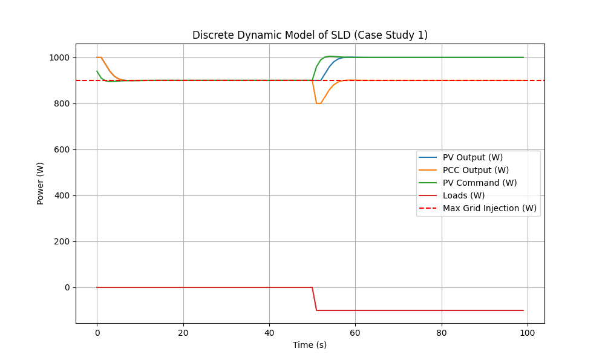

# Resolution for ELUM Recruitment Process Challenge
This repository contains the resolution of the ELUM recruitment process, which consists of a coding problem for two case studies. The resolution of the case study 1 is `PVInverterMaxController()` in the file `case_study_1.py` and case study 2 is `PVMaxBESSController()` in the file `case_study.2.py`.

Falta:
1. Figuras control loops
5. Resultados 

## Case study 1

**Objective:** Implement a controller algorithm whose output must be calculated so to optimize the PV production while respecting:
> The active power injected into the grid should not exceed the control parameter Maximum active power injection into the grid where 
pcc_power = pv_power_out + load_power

*Inputs*:
pcc_power (variable)
pv_power_out (variable)
max_power_injection_grid (parameter)
nominal_pv_power (parameter)

*Output*:
max_pv_power_command (variable)

**Closed-loop system**

*Control objectives*
1. Optimize PV production
2. Respect max_power_injection_grid>= pcc_power

*Assumptions*:
1. PV inverter is an inner loop control with an optimal controller
2. We assume PV inverter has a dynamic of a first-order response
3. We assume load is only negative
4. Loads are random

**Strategy**
>Guarantee that any load in the system can compensated by PV production

**Proposition** : 
1. An PI controller that minimizes the error between pcc_power and maximum of the grid 
2. It can be enough to rejection of lead disturbances
3. Add of a saturation to guarantee max_pv_power_command respects nominal operation

**Results**

**Possible improvements** :
1. Include feedforward actions if loads as we can estimate loads
2. Model PV inverter dynamics to find control gain with optimization methods
3. If possible to measure how much PV produces, we can activite control when such production is greater than nominal

## Case study 2

**Objective:** Implement a controller algorithm whose output must be calculated so to optimize the PV production while respecting:
> The active power injected into the grid should not exceed the control parameter Maximum active power injection into the grid where 
pcc_power = pv_power_out + load_power + bess_power_out

*Inputs*:
pcc_power (variable)
pv_power_out (variable)
bess_power_out (variable)
bess_soc (variable)
max_power_injection_grid (parameter)
nominal_pv_power (parameter)
nominal_bess_power (parameter)

*Outputs*:
max_pv_power_command (variable)
bess_power_setpoit (variable)

**Closed-loop system**

*Control objectives*
1. Optimize PV production
2. Respect max_power_injection_grid>= pcc_power

*Assumptions*:
1. PV inverter is an inner loop control with an optimal controller
2. We assume PV inverter has a dynamic of a first-order response
3. We assume load is only negative
4. Loads are random
5. BESS can be reduced to a elecrical court-circuit model 
6. BESS has a minimum and maximum power to respect
7. BESS charges or discharges up to max/min capacity

**Strategy**
>Prioritize PV inverter to increase maximum allowed if not exceeds grid limits
otherwhise use battery to eliminate excess of energy unless battery is fullcharged or maximum discharge power. In this case, reduce PV output.
Discharge BESS only when PV production not enough to supply loads

**Proposition**
2 PI controller single-input-single-output with hierarchical corrections

**Results**

**Improvements**
Possible improvements:
1. If we know how much enters in PV inverter, we can discharge BESS also to allow increase PV max.
2. Use of MPC or other MIMO controllers to prioritize not 1 or another PI controller.

## Unit tests
Run:
`python3 -m unittest discover tests/<name_module>`